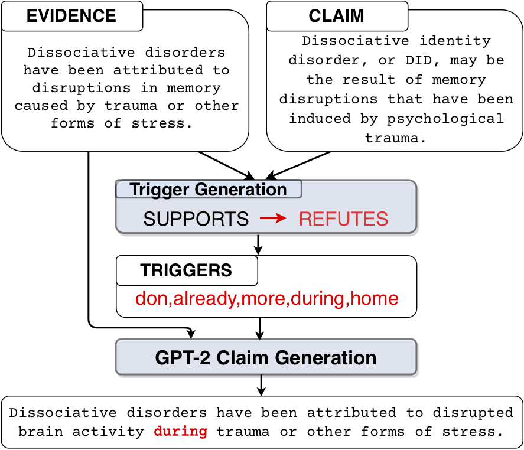

# Generating Label Cohesive and Well-Formed Adversarial Claims
This is the code base for the paper [Generating Label Cohesive and Well-Formed Adversarial Claims](https://arxiv.org/abs/2009.08205) to be presented at EMNLP 2020.

<p align="center">
  
</p>

Adversarial attacks reveal important vulnerabilities and flaws of trained models. 
One potent type of attack are *universal adversarial triggers*, which are individual n-grams that, 
when appended to instances of a class under attack, can trick a model into predicting a target class. 
However, for inference tasks such as fact checking, these triggers often inadvertently *invert 
the meaning of instances* they are inserted in. In addition, such attacks produce *semantically 
nonsensical inputs*, as they simply concatenate triggers to existing samples. 
Here, we investigate how to **generate adversarial attacks against fact checking systems that 
preserve the ground truth meaning and are semantically valid**. We extend the HotFlip attack 
algorithm used for universal trigger generation by jointly minimising the target class loss 
of a fact checking model and the **entailment class loss of an auxiliary natural language inference 
model**. We then train a **conditional language model to generate semantically valid statements**, 
which include the found universal triggers. We find that the generated attacks maintain the 
directionality and semantic validity of the claim better than previous work.


## Citation
```bib
@article{atanasova2020generating,
  title={Generating Label Cohesive and Well-Formed Adversarial Claims},
  author={Atanasova, Pepa and Wright, Dustin and Augenstein, Isabelle},
  booktitle={Proceedings of the 2020 conference on empirical methods in natural language processing (EMNLP)}
  year={2020}
}
```


# Dataset Preparation
1. We join each claim with its gold evidence sentences from the Wikipedia pages. 
This is done for SUPPORTS and REFUTES classes as NEI do not have evidence.<br>
`export PYTHONPATH=./`<br>
`python scripts/create_nli_dataset.py --dataset_dirs data/paper_train.jsonl --wiki_dir data/wiki-pages/wiki-pages/ --output_paths data/train_sr_nli.jsonl`

2. We then collect evidence sentences for the NEI class using the Papelo system from FEVER'2018 
and merge the outputs of the system for the NEI class with the gold evidence sentences collected in the previous step.<br>
`PYTHONPATH=fever2018-retrieval/src`<br>
`python fever2018-retrieval/src/scripts/retrieval/ir.py --db data/fever/fever.db --model data/index/fever-tfidf-ngram\=2-hash\=16777216-tokenizer\=simple.npz --in-file data/fever-data/train_nei.jsonl --out-file data/fever/train_nei.sentences.p5.s5.jsonl --max-page 2 --max-sent 2`
<br><br>
`python scripts/aggregate_papelo_nei.py --dataset_dirs data/fever/train_nei.sentences.p5.s5.jsonl --wiki_dir data/wiki-pages/wiki-pages/ --output_paths data/train_nei_nli.jsonl`
<br><br>
`python scripts/merge_nli_files.py --sr_file data/train_sr_nli.jsonl --nei_file data/train_nei_nli.jsonl --output_path data/train_nli.jsonl`

# Builder Models
We train a RoBERTa model on the data prepared in the previous step which is used for the adversarial attacks <br>
`python builders/train_transformer.py --gpu --lr 2e-5 --model_path fever_roberta_2e5 --batch_size 8 --type roberta`

# Trigger Generation
Triggers can be generated with varying the weights for the FC and the NLI objective. For example, for attacks only using the FC objective, the weights are --fc_w 1 --nli_w 0 : <br>
`python attack_multiple_objectives/attack_fc_nli_trans.py --gpu --model_path fever_roberta_2e5 --fc_model_type roberta --batch_size 10 --trigger_length 3 --labels 3 --epochs 20 --fc_w 1 --nli_w 0 --attack_class SUPPORTS --target REFUTES`

The resulting triggers are serialized to the attack_results directory.
The code is based on the code of the [Universal Adversarial Attacks](https://github.com/Eric-Wallace/universal-triggers)
## To evaluate the generated triggers:
`python attack_multiple_objectives/eval_triggers.py --gpu --model_path fever_roberta_2e5 --fc_model_type roberta --batch_size 4 --labels 3 --triggers_file data/fc10_nli0_ppl0_SUPPORTS_to_REFUTES_1_triggers.tsv --attack_class SUPPORTS`

# Conditional Adversarial Claim Generation